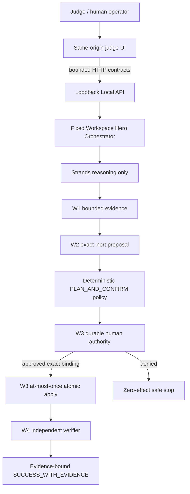

# Portable Judge Experience — W5

## Outcome

W5 turns the certified W1–W4 workspace-remediation chain into the featured judge-facing product
flow. It is additive to the existing B3 loopback Local-2 application: it does not add a second
approval system, a direct executor endpoint, a browser-side authority path, or a live-cloud
dependency. The screen presents one coherent sequence:

```text
Observe -> Evidence -> Root Cause -> Exact Patch -> Policy -> Human Decision
        -> Execute Once -> Independent Verify -> Receipt -> Replay Rejected
```

The headline is: **The model proposes. The human authorizes. Evidence decides.** The interface
labels the fixed story `DEMO SANDBOX`, `PORTABLE / MOCK`, `STRANDS`,
`HUMAN AUTHORITY REQUIRED`, `NO LIVE AWS WRITES`, and `NO EXTERNAL EGRESS`. It never describes a
synthetic resource or local mutation as live AWS. The browser is intentionally limited to bounded
Non-Zero application contracts rather than receiving direct tool, file, process, or mutation
access. The two older CloudOps stories remain available as backward-compatible regression paths.

## Start in one command

From the repository root after installing the declared dependencies:

```bash
.venv/bin/python scripts/run_local_hitl_api.py --open-browser
```

The server binds only to `127.0.0.1`. The launcher transfers the owner-only credential in the URL
fragment, which is not sent in the HTTP request, and the page removes it immediately. The credential
is exchanged once for a `SameSite=Strict`, `HttpOnly` session cookie. The raw token is not written to
browser storage, printed in the page, returned by the API, or included in screenshots. If automatic
browser opening is unavailable, open the printed loopback URL and use the owner-only token file
through **Manual local-session fallback**.

## Three-minute primary flow

1. Confirm the visible `DEMO SANDBOX`, `PORTABLE / MOCK`, and `STRANDS` labels plus zero real-cloud
   writes and zero external network calls.
2. Select **Fix a Failed Deployment Safely**. The server materializes the sealed incident, invokes
   bounded W1 investigation, and creates one inert W2 patch for `render.yaml`.
3. Inspect the observed exit `127`, `File name too long`, root-cause inference, exact unified diff,
   supporting evidence, and workspace/proposal/patch fingerprints.
4. Select **Review exact request**, then **Approve exact change** or **Deny**. Only the decision and
   displayed request fingerprint cross the browser boundary. The target, patch, workspace, nonce,
   and verification profile remain server-owned.
5. Approval is visibly not execution and not success. Select **Execute approved patch once**. W3
   performs one exact atomic replacement and stops at `PATCH_APPLIED_UNVERIFIED`.
6. Select **Independently verify**. W4 reopens disk truth, proves the exact change and fixed startup
   contract, and only then persists `SUCCESS_WITH_EVIDENCE`.
7. Select **Prove replay rejection**. The consumed approval reconciles to the existing receipts with
   patch-apply count `1`, additional mutation delta `0`, and additional profile executions `0`.

For denial, start a fresh fixed hero run and select **Deny** after reviewing the request. The result
is `DENIED_BY_HUMAN`, the workspace mutation count remains zero, and no executor or verification
receipt exists. The older Elastic IP approve and security-group denial stories remain unchanged
under **Secondary CloudOps regression stories**.

## Authority and API boundary



The diagram shows product ownership, not a browser-to-tool call graph. W5 composes the existing
W1–W4 services and exact W3 repository; it does not recreate approval, apply, recovery, or
verification semantics. The UI does not expose a tool or provider call directly.

The loopback surface is:

| Method and path | Purpose | Mutation authority |
|---|---|---|
| `GET /health` | process liveness | none |
| `GET /ready` | portable/provider/sandbox readiness truth | none |
| `GET /` | self-contained judge UI | none |
| `GET/POST/DELETE /api/session` | inspect, exchange, or clear browser authentication | none |
| `POST /api/runs` | start one server-budgeted observation and proposal | none |
| `GET /api/runs/{run_id}` | sanitized durable view and audit timeline | none |
| `POST /api/runs/{run_id}/approval-request` | create an exact expiring challenge | none |
| `POST /api/runs/{run_id}/decision` | persist exact human approval or denial | decision only |
| `POST /api/runs/{run_id}/resume` | resume the already bound workflow | one allow-listed sandbox effect at most |
| `POST /api/workspace-demo/runs` | start only `FAILED_RENDER_DEPLOYMENT_VERIFIED_FIX_V1` | none |
| `GET /api/workspace-demo/runs/{run_id}` | sanitized durable hero projection | none |
| `POST /api/workspace-demo/runs/{run_id}/approval-request` | persist the exact W3 request | none |
| `POST /api/workspace-demo/runs/{run_id}/decision` | persist approve/deny for the current fingerprint | decision only |
| `POST /api/workspace-demo/runs/{run_id}/resume` | invoke the existing W3 at-most-once apply/replay path | one exact private-workspace effect at most |
| `POST /api/workspace-demo/runs/{run_id}/verify-or-reconcile` | invoke the proposal-ID-only W4 verifier | fixed trusted profile only |

There is deliberately no `/execute`, `/mutate`, arbitrary shell, URL, cloud-client, or browser tool
endpoint. Cookie-authenticated state-changing requests also require the non-simple
`X-AIOA-Intent: judge-console-v1` header. Bearer authentication remains available to existing local
verification clients.

## Evidence projection

`GET /api/runs/{run_id}` returns a judge-safe projection of authoritative state:

- run, trace, and workflow state;
- resource evidence and provenance;
- exact inert proposal and evidence fingerprint;
- approval-request, decision, intent, receipt, and verification hashes;
- before/after resource state;
- per-run and process-local sandbox mutation counts;
- provider and external-network counters; and
- a bounded, ordered, redacted audit timeline.

Raw bearer values, decision nonces, nonce hashes, actor-session identifiers, credentials, exception
text, and environment values are excluded. Audit metadata uses a fixed allowlist. A refreshed page
retains only the non-secret run ID in its fragment and reloads durable truth through the HttpOnly
session.

The W5 projection additionally returns exactly ten typed timeline items, the fixed incident facts,
server-derived approval card, display-only W2 diff, before/after proof, independent report and
receipt fingerprints, and bounded replay/recovery status. It never returns raw durable records,
absolute workspace paths, operator/session values, or caller-selectable mutation material.

## Browser and concurrency behavior

- All action buttons enter a shared busy state before awaiting a response, preventing accidental
  double-click dispatch from one tab.
- Backend idempotency remains authoritative: a repeated terminal resume reconciles the receipt
  instead of executing again.
- A second approval request supersedes an older tab's challenge. The stale decision fails closed;
  the UI reloads durable truth and asks the judge to review the current exact request.
- Refresh restores the run ID and state. Restarting the local server with the same paths restores the
  durable checkpoint and receipt.
- W5 uses `#hero_run=<non-secret-id>` and reloads the authoritative projection; it stores no W3
  nonce, request body, patch, or secret in browser storage.
- The responsive layout has dedicated desktop and sub-700px behavior, horizontal stage scrolling,
  44px minimum controls, focus-visible outlines, reduced-motion support, and polite live status.

Historical B3 reference captures remain valid for the unchanged CloudOps regression stories:

- [Desktop verified-success state](assets/judge-ux-desktop-success.png)
- [Desktop human-denial state](assets/judge-ux-desktop-denied.png)
- [Mobile verified-success state](assets/judge-ux-mobile-success.png)

## Verification

Focused B3/B4 checks:

```bash
.venv/bin/python -m pytest -q \
  tests/unit/test_judge_console_ui.py \
  tests/unit/test_judge_console_launcher.py \
  tests/unit/test_local_hitl_api.py \
  tests/integration/test_local_hitl_http_server.py \
  tests/integration/test_portable_judge_experience.py
.venv/bin/python scripts/run_b4_hardening_gate.py
.venv/bin/python -m ruff check .
```

The integration suite uses the real loopback server and proves cookie bootstrap, approve, stale-tab
rejection, duplicate resume, restart recovery, denial, sanitized evidence, one approved sandbox
mutation, zero denied mutations, and zero provider/cloud network calls. Chrome reference captures
are generated locally against loopback with external host resolution blocked. They are visual evidence, not a
substitute for the contract suite.

The focused W5 suite is:

```bash
.venv/bin/python -m pytest -q tests/integration/test_workspace_judge_hero.py
```

It exercises the complete approve/apply/verify/replay and denial journeys, reconstructs a run from
durable state, checks stale and cross-run bindings, rejects caller-controlled path/content/diff/
command/URL/nonce fields, verifies owner-only state, statically checks the responsive safe-rendering
UI, and runs the exact certified W4 `render_start_contract_v1` process proof. W5 screenshots were
not captured because this phase did not attach automation to the operator's existing browser.

## Intentional limits

- This is not a public endpoint and has no CORS allowance.
- The loopback API has bounded body/header sizes, socket waits, and handler concurrency; it does not
  claim a public multi-user identity or rate-limiting service.
- The deterministic model path requires no paid key and makes no external request.
- The browser does not claim live Strands model inference, AWS identity, IAM effectiveness, Bedrock
  access, production availability, or real infrastructure mutation.
- B4 local reliability/security/evidence hardening is complete; externally anchored signatures and
  public-host controls are not claimed.
- Historical B5/B6 evidence remains preserved but predates W5 runtime/UI code. A final RC B5/B6
  recertification is required before this W5 branch can become a release/publication claim.
- The exact trusted W4 process helper is repository-owned under `scripts/`; W5 is certified from a
  clean source checkout. Packaging that helper into a future release image is a release-boundary
  task and is not solved by weakening the source-security guard or changing the frozen Dockerfile
  during W5.
