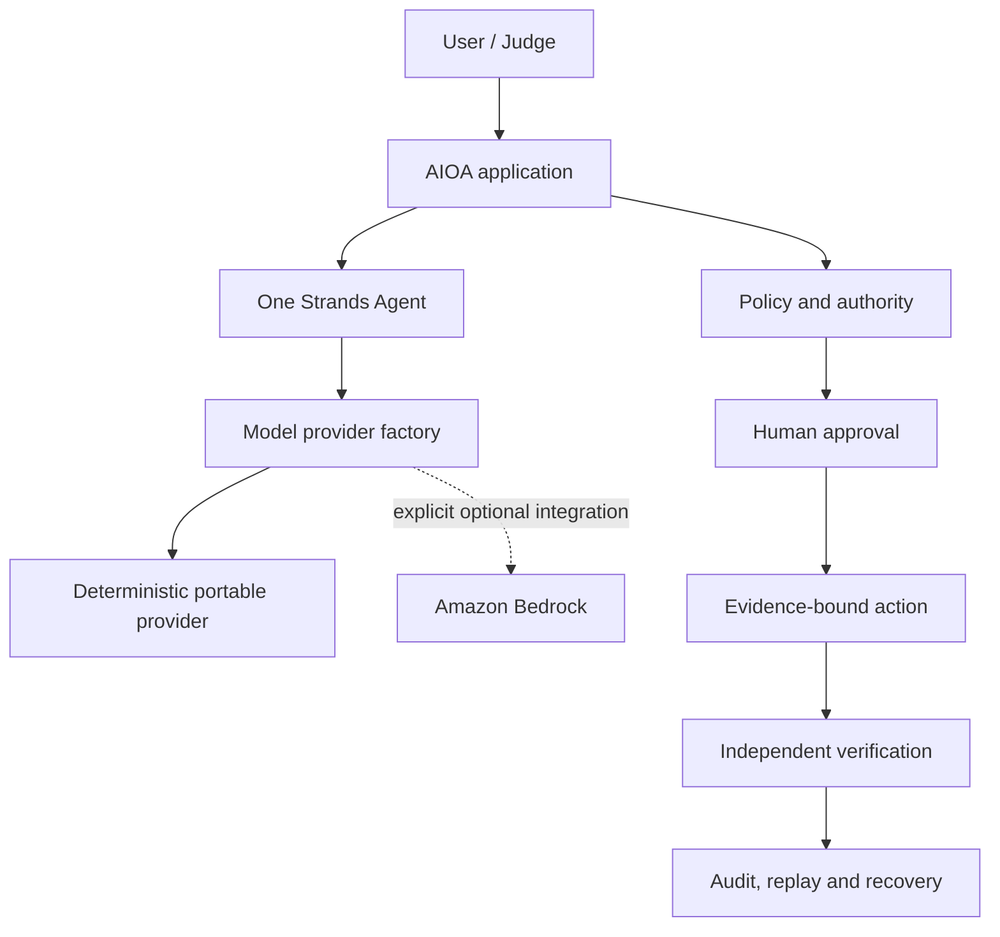

# AIOA Portable Runtime

## Contract

Portable mode is the supported default application runtime:

```text
AIOA_RUNTIME_MODE=portable
AIOA_MODEL_PROVIDER=mock
AIOA_AWS_INTEGRATION_ENABLED=false
```

It imports and starts without AWS credentials, credential discovery, a model API key, a local LLM,
or a network service. It creates the real canonical `strands.Agent` and the frozen five-tool surface.
The deterministic model is a native Strands `Model`; model output remains untrusted and receives no
execution authority.



AWS, Bedrock, DynamoDB, Lambda, CloudWatch, S3, and AgentCore are optional integration or deployment
targets. None is required for import, startup, tests, Strands execution, HITL, evidence, replay,
recovery, the local API, or the judge demo. Historical AWS deployment contracts remain preserved but
do not grant deployment or mutation authority.

## Provider selection

| Mode | Provider | Result |
| --- | --- | --- |
| `portable` | `mock` | supported default; zero provider network calls |
| `portable` | `bedrock` | rejected; no fallback |
| `aws` | `mock` | rejected; no ambiguous substitution |
| `aws` | `bedrock` | optional integration; explicit opt-in and settings required |

The single factory is `providers/factory.py::create_model_provider`. Bedrock imports and client
construction are lazy and reachable only after explicit AWS selection. Missing AWS configuration or
provider availability returns a fixed, typed failure. It never silently falls back to mock.

No paid non-AWS provider is shipped in B0-B2. The existing Strands `Model` boundary can accept one in
a later phase without changing the agent or Non-Zero controls. Deterministic completion and judging
therefore have no secret, paid API, large local model, or hidden network requirement.

## Run locally

After installing the pinned project dependencies:

```bash
cp .env.example .env.local
AIOA_RUNTIME_MODE=portable \
AIOA_MODEL_PROVIDER=mock \
AIOA_AWS_INTEGRATION_ENABLED=false \
.venv/bin/python scripts/run_portable_demo.py
```

The command prints one validated JSON bundle and writes an owner-only copy to
`.local/portable/portable-demo-receipt.json`. It uses a disposable workspace by default. To retain
the sandbox state for inspection, pass a new or empty directory:

```bash
.venv/bin/python scripts/run_portable_demo.py \
  --workspace .local/portable/workspace-001 \
  --output .local/portable/receipt-001.json
```

The command refuses AWS mode even when AWS is otherwise explicitly configured. It never deploys or
calls a live cloud API.

## Verification

```bash
.venv/bin/python -m pytest -q tests/integration/test_portable_judge_sandbox.py
.venv/bin/python -m pytest -q tests/unit/test_portable_runtime_boundary.py
.venv/bin/python -m pytest -q tests/unit/test_model_provider_factory.py
.venv/bin/ruff check .
.venv/bin/python -m pip check
```

## Troubleshooting

- `PORTABLE_RUNTIME_CONFIGURATION_INVALID`: remove conflicting runtime variables or set the three
  portable values shown above. No provider fallback occurs.
- `PORTABLE_DEMO_REQUIRES_PORTABLE_MOCK_RUNTIME`: the judge command was given an AWS runtime; use the
  portable settings. The workspace is untouched.
- `VERIFIER_WORKSPACE_NOT_EMPTY`: choose a new or empty retained workspace. Existing evidence is not
  deleted or overwritten.
- `PORTABLE_STRANDS_RUNTIME_UNAVAILABLE`: install the pinned project dependencies. Do not replace the
  Strands runtime with a custom loop.
- `PORTABLE_OUTPUT_SYMLINK_FORBIDDEN`: choose a regular evidence path; the writer will not follow an
  output symlink.
- `PORTABLE_OUTPUT_EXISTING_FILE_UNSAFE`: the selected existing output is not an owner-only, valid
  portable receipt. Choose the canonical `.local/portable/` output or a new path; unrelated files
  are deliberately preserved.
- `local durable state is corrupt or unreadable`: B4 accepts only the versioned integrity envelope.
  Preserve an older unsealed file for forensics and choose fresh local truth/inventory paths; no
  implicit migration or destructive deletion occurs.

The loopback API keeps liveness and readiness separate. `/health` reports process response only.
`/ready` validates portable/mock provider truth plus readable durable and sandbox snapshots and
returns a redacted retryable `503` when either protected file is corrupt.
